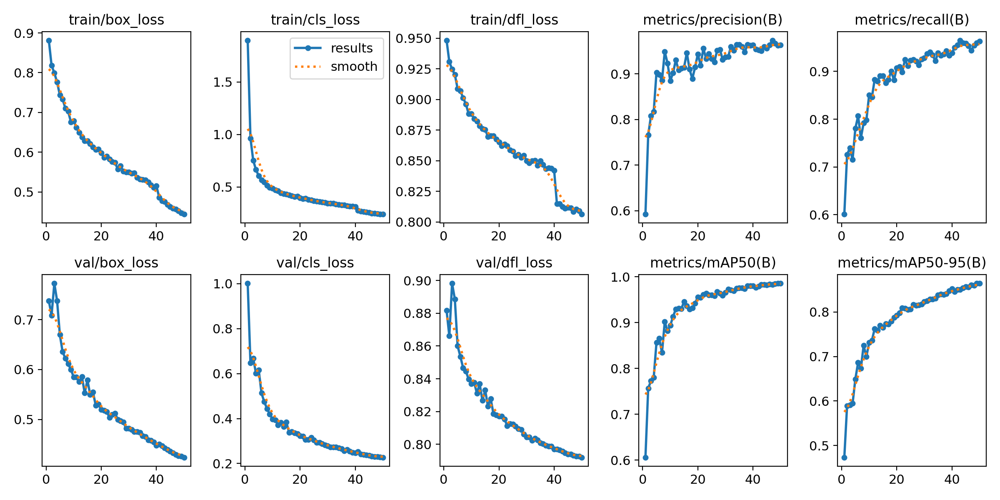
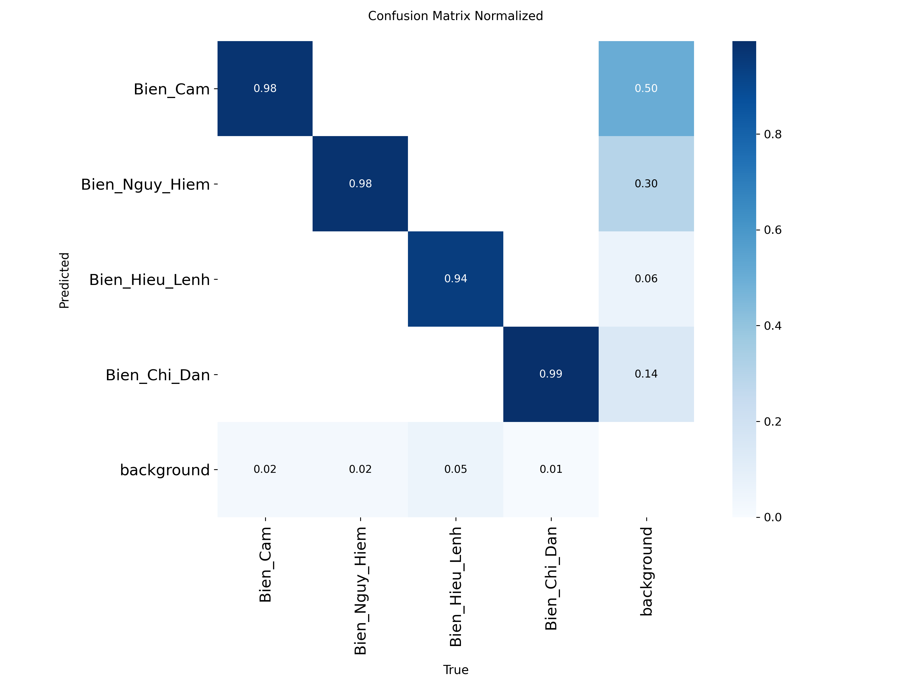
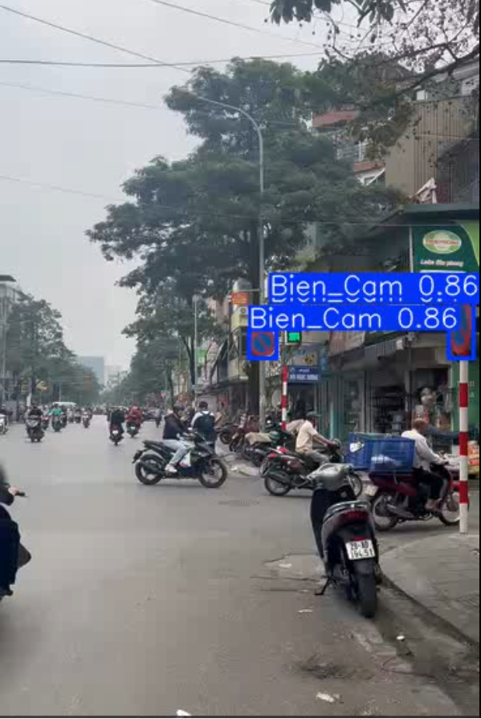

# 🚦 Real-time Vietnamese Traffic Sign Detection (YOLOv8)


## 📖 1. Tổng quan Dự án (Abstract)
Dự án này ứng dụng mô hình Deep Learning **YOLOv8** để giải quyết bài toán phát hiện và phân loại biển báo giao thông tại Việt Nam theo thời gian thực (Real-time Object Detection). 

Hệ thống được thiết kế tối ưu hóa để có thể xử lý mượt mà trên Video/Camera hành trình, đóng vai trò như một module Thị giác máy tính (Vision Module) lõi, sẵn sàng tích hợp vào các hệ thống AI Agent hỗ trợ lái xe an toàn (ADAS) trong tương lai.

---

## 📊 2. Dữ liệu & Tiền xử lý (Dataset & Preprocessing)
Dữ liệu gốc được cung cấp dưới dạng 56 lớp (classes) biển báo chi tiết. Tuy nhiên, để tối ưu hóa khả năng khái quát hóa (generalization) của mô hình và tăng tốc độ suy luận (inference speed) trên các thiết bị Edge, dữ liệu đã được tiến hành **Data Engineering** và gom nhóm (mapping) về **4 Siêu lớp (Super-classes)** chuẩn theo Luật Giao thông đường bộ Việt Nam:

0. `Bien_Cam` (Biển Cấm)
1. `Bien_Nguy_Hiem` (Biển Nguy Hiểm)
2. `Bien_Hieu_Lenh` (Biển Hiệu Lệnh)
3. `Bien_Chi_Dan` (Biển Chỉ Dẫn)

* **Nguồn Raw Dataset:** [Vietnam Traffic Sign Dataset on Roboflow](https://universe.roboflow.com/giang-yp9g1/vietnam-traffic-sign-altsi/dataset/3)
* **Quy mô:** ~8,600+ hình ảnh chất lượng cao kèm nhãn (labels).

---

## 📈 3. Đánh giá Mô hình (Results & Evaluation)
Mô hình `YOLOv8n` (bản Nano) được huấn luyện trong 50 Epochs với phần cứng GPU Tesla T4. Các chỉ số cho thấy mô hình đã hội tụ tốt và đạt độ mượt mà cao khi chạy thực tế (Inference speed ~2.1ms/ảnh).

### Biểu đồ Huấn luyện (Training Curves)
*(Thể hiện mô hình không bị Overfitting, Loss giảm đều và mAP tăng ổn định)*


### Ma trận Nhầm lẫn (Confusion Matrix)
*(Phân tích tỷ lệ đoán trúng/sai giữa các nhóm biển báo)*


### 📸 Demo Nhận diện Thực tế (Deployment)
*Video/Ảnh chụp thực tế minh họa khả năng Tracking của hệ thống trên đường phố Việt Nam.*


---

## ⚙️ 4. Hướng dẫn Cài đặt & Sử dụng (Quick Start)

### Yêu cầu hệ thống (Prerequisites)
* Hệ điều hành: Windows / Linux / macOS
* Python >= 3.9

### Bước 1: Clone dự án và Cài đặt môi trường
```bash
# Clone repository
git clone [https://github.com/Duypq1612/Vietnamese-Traffic-Sign-Detection-YOLOv8.git](https://github.com/Duypq1612/Vietnamese-Traffic-Sign-Detection-YOLOv8.git)
cd Vietnamese-Traffic-Sign-Detection-YOLOv8

# Tạo môi trường ảo (Khuyên dùng)
python -m venv venv
# Kích hoạt venv (trên Windows PowerShell):
.\venv\Scripts\activate

# Cài đặt thư viện lõi
pip install ultralytics opencv-python
